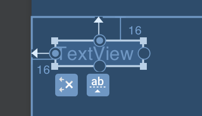
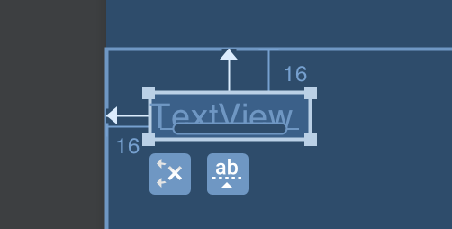
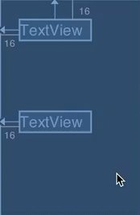
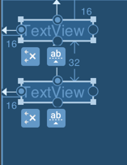
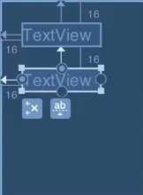

### What are constraints?

The fundamental building block of _ConstraintLayout_ is creating constraints. A constraint defines a relationship between
two widgets in the layout and controls how those widgets will be positioned within the layout. For those new to
_ConstraintLayout_, but familiar with _RelativeLayout_ the basic principles of how constraints work is very similar
to how we create relationships between widgets in _RelativeLayout_.

### Creating constraints in the editor
The easiest way to learn how to create constraints is using the visual editor in Android Studio. All of the examples
here will show how the blueprint view represents things. Let's start by looking at a simple _TextView_ in the blueprint
view:


The _TextView_ should be fairly obvious, and the two arrows show some existing constraints on this _TextView_ which
align the left and top edges to the parent _ConstraintLayout_. We'll look at how to create this in a little while. We
can also see the 16dp margins which will add some space between the parent _ConstraintLayout_ and the bounds of the
_TextView_. If we select the _TextView_ we will see the sizing and anchor points:



The squares on the corners are the resizing points and we can drag these to resize the _TextView_. These are not as
useful as they may first appear because using them will result in a fixed size of the _TextView_ and we will normally
want the _TextView_ sized dynamically in some way.

The circles in the middle of each edge are the anchor points, and it is these which enable us to create constraints.
The anchor points on the left and top edges contain a blue circle which indicates that a constraint has been defined
for this anchor point; and the ones on the rightand bottom edge are empty which indicates that no constraint has been
defined for them. So we can see how the position of the _TextView_ has been defined by aligning the top and left edges
to the parent.

 Any _Views_ which subclass _TextView_ also have an additional type of anchor point: the baseline. This enables us to
 align the baseline of the text in the _TextView_ as well. We can view this by clicking the 'ab'  button below the
 _TextView_:

 

The sausage-like shape is the baseline anchor point and we can create constraints from this in exactly the same way
as we are about to see with the four edge anchor points.

The other button below the _TextView_ (the one containing the 'x') will remove all constraints.

To create a constraint we simple need to grab an anchor point of one view, and drag it to the anchor point of another.
Here we have added a second _TextView_ which has a left constraint to the parent, and we create a new constraint from
it's top to the bottom of the first _TextView_. This will position the second _TextView_ below the first one:



How about if we want to create a constraint to the parent layout itself? that is simply a case of dragging the anchor
point to the appropriate edge of the parent:


One thing worth noting is that while we have created a constraint from the top of `textView2` to the bottom of
`textView`, if we select both of the _TextViews_ then we only see a constraint is attached to the top of `textView2`
and there is no constraint associated with `textView`:



The reason for this is that constraints are one way (unless we're talking about chains which are a special case). So
the constraint in question is attached to `textView2`, and will position it relative to `textView`. It controls how
`textView2` will be positioned relative to `textView` so has no direct influence on where `textView` is positioned.

### Creating constraints in XML

For those who like to understand what's going on under the bonnet / hood, then the XML for that layout is:

```xml
<?xml version="1.0" encoding="utf-8"?>
<android.support.constraint.ConstraintLayout
  xmlns:android="http://schemas.android.com/apk/res/android"
  xmlns:app="http://schemas.android.com/apk/res-auto"
  xmlns:tools="http://schemas.android.com/tools"
  android:layout_width="match_parent"
  android:layout_height="match_parent"
  tools:context=".MainActivity">

  <TextView
    android:id="@+id/textView"
    android:layout_width="wrap_content"
    android:layout_height="wrap_content"
    android:layout_marginStart="16dp"
    android:layout_marginTop="16dp"
    app:layout_constraintLeft_toLeftOf="parent"
    app:layout_constraintTop_toTopOf="parent"
    tools:text="TextView" />

  <TextView
    android:id="@+id/textView2"
    android:layout_width="wrap_content"
    android:layout_height="wrap_content"
    android:layout_marginStart="16dp"
    android:layout_marginTop="8dp"
    app:layout_constraintLeft_toLeftOf="parent"
    app:layout_constraintTop_toBottomOf="@+id/textView"
    tools:text="TextView" />
</android.support.constraint.ConstraintLayout>
```

The constraints are the attributes which begin with `app:layout_constraint`. We can see those the the parent. and the
constraint on `@+id/textView2` which specifies the top of the view should be relative to the bottom of `@+id/textView1`.

It is worth noting that these are in the `app` namespace because _ConstraintLayout_ is imported as a library so, like
the support libraries, it becomes part of your app rather than the Android framework (which uses the `android`
namespace).

#### Deleting a constraint
The final things we'll cover here is how to delete a constraint. In XML it is simply a case of deleting the attribute
which defines the constraint, but in the editor we simply click on the anchor point:


