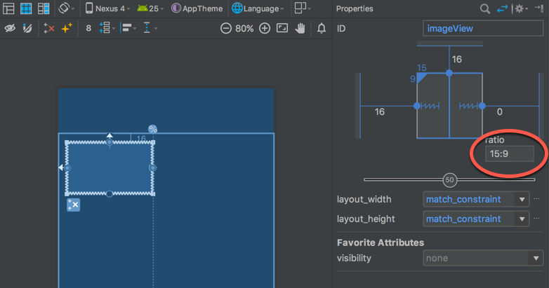
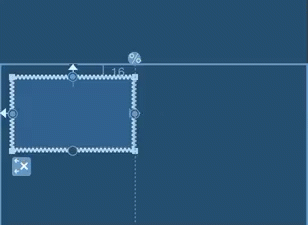

### Dimensions

Sometimes we need to create views which have a fixed aspect ratio. This is particularly useful with `ImageView` if we need to display images which come from a feed, and we know that any images we get will be of a specific aspect ratio. For example we may have book cover art (the specifics of which can vary enormously, so we'll leave it there!); or movie posters (which are commonly 4:6); or perhaps stills from movies (commonly 1.85:1 or 2.39:1) or tv (commonly 4:3 or 16:9). 

For those unfamiliar with aspect ratios, `w:h` denotes the ratio of width to height. For an aspect ratio of `4:6` a width of `40dp` would have a height of `60dp`; and a width of `30dp` wold have a height of `45dp`.

If our images are _guaranteed_ to all be precisely the same aspect ratio then we can simply use `wrap_content` in both dimensions and the job is done. However, in the real world often there are minor variations - usually due to mathematical rounding. If we have an image in isolation this is not usually a problem, but if we are displaying multiple images then small differences in size can have knock on effects and other views which are aligned to the images echo those differences. Even minor discrepancies can make a layout look unbalanced.

One solution to this is to subclass `ImageView` and override `onMeasure()` to apply a fixed aspect ratio. More recently `PercentLayout` (which is available as a support library) provides a mechanism to fix the aspect ratio of a child view.
 
 `ConstraintLayout` also provides a mechanism for fixing the aspect ratio of a child view. Select the child view that we want to control, and then set the `ratio` value (circled):
 
 
 
 The view that we've applied this to is constrained to the `top` and `start` edges of the parent `ConstraintLayout` - I will refer to `start` rather than `left` to be friendly towards right-to-left languages. The `end` edge is constrained to a [guideline](guidelines.html), and the bottom edge is unconstrained. Both `layout_width` and `layout_height` are set to `match_constraint` meaning that they will match any constraints that are set. The width of this view will be determined during the layout pass, but the height looks to be indeterminate. However, because of the ratio value, the height can be determined as a function of the width (in the example this is `16:9`).
 
 The result of this is that if the width of the view changes then so will the height. We can demonstrate this by moving the guideline that the `end` edge is constrained to:
 

  
### DimensionRatio XML
  
  The XML for this is:
  
  ```xml
  <android.support.constraint.ConstraintLayout xmlns:android="http://schemas.android.com/apk/res/android"
    xmlns:app="http://schemas.android.com/apk/res-auto"
    xmlns:tools="http://schemas.android.com/tools"
    android:layout_width="match_parent"
    android:layout_height="match_parent"
    tools:context="com.stylingandroid.scratch.MainActivity">
  
    <View
      android:id="@+id/imageView"
      android:layout_width="0dp"
      android:layout_height="0dp"
      android:layout_marginStart="16dp"
      android:layout_marginTop="16dp"
      app:layout_constraintDimensionRatio="h,15:9"
      app:layout_constraintEnd_toStartOf="@+id/guideline"
      app:layout_constraintStart_toStartOf="parent"
      app:layout_constraintTop_toTopOf="parent" />
  
    <android.support.constraint.Guideline
      android:id="@+id/guideline"
      android:layout_width="wrap_content"
      android:layout_height="wrap_content"
      android:orientation="vertical"
      app:layout_constraintGuide_percent="0.39" />
  
  </android.support.constraint.ConstraintLayout>
  ```

The aspect ratio of the view is set using the `app:layout_constraintDimensionRatio` attribute. This has two components: an orientation, and the ratio. 

The editor has inferred that the width is the input to the function and has therefore given the orientation of `h` for `horizontal`. The orientation can be omitted and it will be inferred during the layout pass, but it can be useful to explicitly set an orientation if we wish to avoid any possible ambiguity. In most cases this is superfluous because the orientation is implicit - in our example the height is indeterminate, so it is easy to infer that it is a function of the width.

The ratio component is pretty self-explanatory it is the aspect ratio that will be applied

The only other thing worth mentioning is how `match_constraint` (which we saw earlier on the `layout_[width|height]` attributes) is actually represented in XML: `0dp`. This behaves in a similar manner to weighted `LinearLayout` where we would specify `0dp` and allow the size to be determined by the parent layout during the layout pass.
