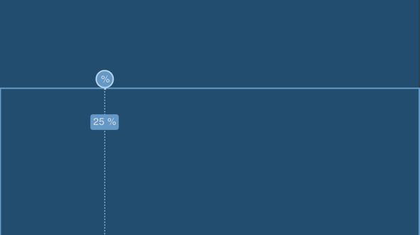
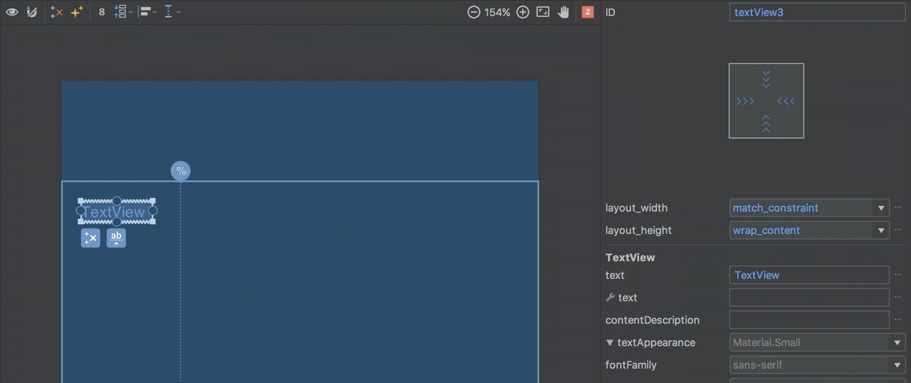
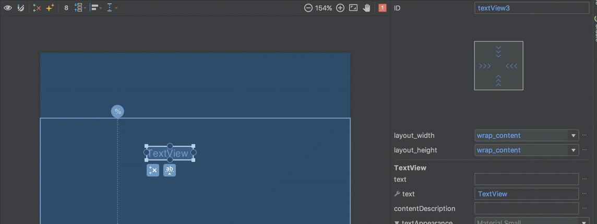

### PercentLayout

`PercentLayout`is generally used in responsive designs to size child views to a percentage of the parent layout's size.

#### Percent width / height in the editor

The first use-case of `PercentLayout` that we'll cover is specifying the width or height of a child view as a percentage of the parent. This is done using the `app:layout_widthPercent` and `app:layout_heightPercent` attributes (note the use of the `app` namespace here because `PercentLayout` is provided in a support library). To achive this we create a [guideline](../basics/guidelines.html) which corresponds to the percentage of the parent. For example, to achieve `app:layout_widthPercent="25%` we first create a guideline at 25% of the width of the parent:



Now we just need to constrain a view to the `start` edge of the parent, and the guideline. I am using `start` in favour of `left` to ensure that we behave nicely for RTL languages.

We need to make sure that teh `android:layout_width` is set to wither `match_constraint` or `0dp` (they are, in fact, the same thing), and remove any margins. Then the view will always be sized to 25% of the parent:



#### Percent width / height in XML

The XML for this is as follows:

```xml
<?xml version="1.0" encoding="utf-8"?>
<android.support.constraint.ConstraintLayout 
  xmlns:android="http://schemas.android.com/apk/res/android"
  xmlns:app="http://schemas.android.com/apk/res-auto"
  xmlns:tools="http://schemas.android.com/tools"
  android:layout_width="match_parent"
  android:layout_height="match_parent">

  <android.support.constraint.Guideline
    android:id="@+id/guideline"
    android:layout_width="wrap_content"
    android:layout_height="wrap_content"
    android:orientation="vertical"
    app:layout_constraintGuide_percent="0.25" />

  <TextView
    android:id="@+id/textView3"
    android:layout_width="0dp"
    android:layout_height="wrap_content"
    android:layout_marginEnd="0dp"
    android:layout_marginStart="0dp"
    tools:text="TextView"
    app:layout_constraintEnd_toStartOf="@+id/guideline"
    app:layout_constraintStart_toStartOf="parent" />

</android.support.constraint.ConstraintLayout>
```

All of the actual work is done by the guideline, it's jsu a case of constraining the view to it, and we get the desired width.

#### Percent margin in the editor

`PercentLayout` also allows us to create a margin as a percentage of the parent. Once again we need to create a guideline to represent the margin that we're after, but instead of using it to set the width of a view, we create the constraint slightly differently to create the equivalent of a percentage margin. For example to achieve `app:layout_marginStartPercent="25%`, we would create a guideline at 25% of the parent width and then align the `start` edge of a view to it:



In this case we've left `android:layout_width="wrap_content"` and, once again, we remove any margin and the view will be positioned with a `start` margin at 25% of the parent width.
 
#### Percent margin in XML

In XML the guideline is identical to the previous example:

```xml
<?xml version="1.0" encoding="utf-8"?>
<android.support.constraint.ConstraintLayout xmlns:android="http://schemas.android.com/apk/res/android"
  xmlns:app="http://schemas.android.com/apk/res-auto"
  xmlns:tools="http://schemas.android.com/tools"
  android:layout_width="match_parent"
  android:layout_height="match_parent">

  <android.support.constraint.Guideline
    android:id="@+id/guideline"
    android:layout_width="wrap_content"
    android:layout_height="wrap_content"
    android:orientation="vertical"
    app:layout_constraintGuide_percent="0.25" />

  <TextView
    android:id="@+id/textView3"
    android:layout_width="wrap_content"
    android:layout_height="wrap_content"
    android:layout_marginStart="0dp"
    app:layout_constraintStart_toStartOf="@+id/guideline"
    tools:text="TextView" />

</android.support.constraint.ConstraintLayout>
```

The difference is in how we constrain the view to it. In this case we specify `app:layout_constraintStart_toStartOf="@+id/guideline"` and set the `android:layout_width` and `android:layout_marginStart` as described for the editor.

#### Aspect ratio in the editor

The final use-case of `PercentLayout` that we'll cover is how to make the height of a view a function of its width, or vice versa. There is a much fuller explanation of how this works in `ConstraintLayout` [here](../basics/dimensions.md). We specify a ratio of the view and ensire that both the `android:layout_width` and `android:layout_height` are set to `match_constraint` or `0dp`:


Then if we constrain both horizontal edges, but leave at least one of the vertical edges unconstrained, then we make the height dependent on the width, and changing the width will also change the hight while maintaining the aspect ratio:


 
#### Aspect ratio in XML

In XML, we must follow the same rules for the constraints as with the editor, and it is the `app:layout_constraintDimensionRatio` attribute that is doing the magic here:

```xml
  <android.support.constraint.ConstraintLayout xmlns:android="http://schemas.android.com/apk/res/android"
    xmlns:app="http://schemas.android.com/apk/res-auto"
    xmlns:tools="http://schemas.android.com/tools"
    android:layout_width="match_parent"
    android:layout_height="match_parent"
    tools:context="com.stylingandroid.scratch.MainActivity">
  
    <View
      android:id="@+id/imageView"
      android:layout_width="0dp"
      android:layout_height="0dp"
      android:layout_marginStart="16dp"
      android:layout_marginTop="16dp"
      app:layout_constraintDimensionRatio="h,15:9"
      app:layout_constraintEnd_toStartOf="@+id/guideline"
      app:layout_constraintStart_toStartOf="parent"
      app:layout_constraintTop_toTopOf="parent" />
  
    <android.support.constraint.Guideline
      android:id="@+id/guideline"
      android:layout_width="wrap_content"
      android:layout_height="wrap_content"
      android:orientation="vertical"
      app:layout_constraintGuide_percent="0.39" />
  
  </android.support.constraint.ConstraintLayout>
  ```
  
  Once again a fuller explanation of this can be found in the article on [dimensions](../basics/dimensions.html).