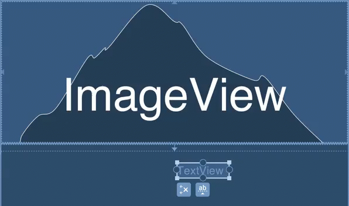

### Centring

A common thing that we need to do in layouts is centre an item either within the parent, relative to a sibline view, or even relative to an edge of a sibling view. In this article we'll look at techniques to achieve all of these. 

Centring is usually done on a view which has an intrinsic `android:layout_[width|height]="wrap_content"`. All of the examples will follow that pattern. 

#### Centring in the parent in the editor

Centring within the parent can be achieved by applying constraints from an edge of the view to the corresponding edge of the parent, and we do this for both constraints in the axis we wish to centre. To centre an item vertically we would constrain the `top` and `bottom` edges, and to centre an item horizontally we would constrain the `start` and `end` edges. I am using `start` and `end` in preference to `left` and `right` to be friendly to RTL languages:


In this case we are constraining the `start` edge of the view to the `start` edge of the parent; and the `end` edge of the view to the `end` edge of the parent. 

#### Centring in the parent in XML

In XML this is pretty much the same, we use `app:layout_constraintStart_toStartOf="parent"` and `app:layout_constraintEnd_toEndOf="parent"`:

```xml
  <TextView
    android:id="@+id/textView"
    android:layout_width="wrap_content"
    android:layout_height="wrap_content"
    app:layout_constraintTop_toBottomOf="parent"
    app:layout_constraintBottom_toBottomOf="parent"
    app:layout_constraintStart_toStartOf="parent"
    app:layout_constraintEnd_toEndOf="parent"/>
```

#### Centring to the middle of a sibling in the editor

Centring with relation to a sibling view is much the same as centring to the parent, the only difference is we create the constraints from an edge of the view we wish to centre to the corresponding edge of the sibling view:



#### Centring to the middle of a sibling in XML

In XML this is, once again, pretty similar. The only difference is that we specify the `android:id` of a sibling rather than using `parent`:

```xml
  <TextView
    android:id="@+id/textView"
    android:layout_width="wrap_content"
    android:layout_height="wrap_content"
    app:layout_constraintTop_toTopOf="@+id/imageView"
    app:layout_constraintBottom_toBottomOf="@+id/imageView"
    app:layout_constraintStart_toStartOf="parent"
    app:layout_constraintEnd_toEndOf="parent"/>
```

#### Centring to the edge of a sibling in the editor

The final centring trick is one that is very difficult to achieve in other layouts without getting really hacky, and that is centring a view to one edge of a sibling. The material design guidelines give [multiple examples of how a FAB should be centred on the edge of a panel](https://material.io/guidelines/components/buttons-floating-action-button.html#buttons-floating-action-button-large-screens), and with `ConstraintLayout` we have an easy way to achieve this. To vertically centre a view to an edge of a sibline We create constraints from _both_ `top` and `bottom` edges of the view we wisth to centre to the _same_ edge of the sibling view:   


#### Centring to the edge of a sibling in XML

Once again, this it pretty straightforward in XML, we create constraints `app:layout_constraintTop_toBottomOf="@+id/imageView"` and `app:layout_constraintBottom_toBottomOf="@+id/imageView"`:

```xml
  <TextView
    android:id="@+id/textView"
    android:layout_width="wrap_content"
    android:layout_height="wrap_content"
    app:layout_constraintTop_toBottomOf="@+id/imageView"
    app:layout_constraintBottom_toBottomOf="@+id/imageView"
    app:layout_constraintStart_toStartOf="parent"
    app:layout_constraintEnd_toEndOf="parent"/>
```
